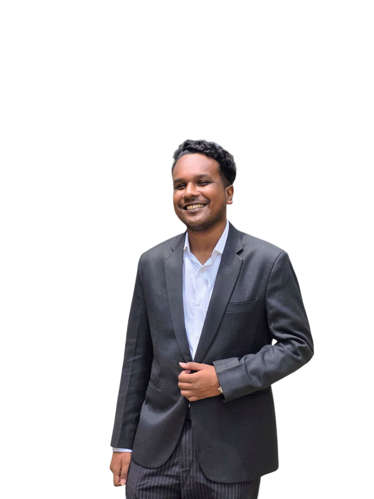

# ⚡ Soumic Kundu Paul — Personal Portfolio

<p align="center">
  
</p>

<p align="center">
  <b>Electrical & Electronic Engineering Undergraduate • Business & Technology Enthusiast</b><br>
  <i>Dhaka, Bangladesh</i>
</p>

<p align="center">
  <a href="mailto:soumic44@gmail.com"></a>
  <a href="https://github.com/Soumic333"></a>
  <a href="assets/Soumic_Kundu_Paul_CV.pdf"></a>
</p>

---

## 🌟 Overview

Welcome to the repository for **Soumic Kundu Paul's** interactive portfolio website. Designed with a dark, high-contrast aesthetic and dynamic animations, this portfolio reflects a passion for bridging engineering fundamentals with strategic business thinking and project leadership.

### ✨ Key Features & Sections

- **Hero Section**: Dynamic space-vector SVG orbit animations, smooth glow effects, and interactive call-to-actions.
- **About Me**: Insight into a cross-disciplinary journey blending technical expertise with commercial acumen (50+ business slide designs, 200+ participants coordinated, 70+ volunteers managed).
- **Featured Projects**:
  - **Footstep Power Harvesting System**: Piezoelectric energy harvesting prototype showcasing hardware testing, system design, and execution.
  - **Live Notice Board**: Real-time ticker showing active projects and research milestones.
- **Leadership & Experience**:
  - **Assistant Director (Administration)** — AUST Robotics Club (AUSTRC)
  - **Student Ambassador** — Tickify
- **Achievements & Competitions**:
  - **HSBC Business Case Competition 2025**: National Round Qualifier
  - **OSCILLON 1.0**: Finalist (National Robotics Competition)
- **Interactive Toolkit**: Categorized breakdown of engineering, analytics, management, and design tools.
- **Continuous Marquee & Certificate Wall**: Smooth RTL scrolling displays celebrating milestones and credentials.

---

## 🛠️ Tech Stack & Architecture

| Technology | Purpose |
|---|---|
| **HTML5** | Semantic, accessible structure and custom inline vector SVGs |
| **CSS3 (Vanilla)** | Glassmorphism, CSS variables, CSS Grid & Flexbox, keyframe animations |
| **JavaScript (ES6+)** | Dynamic scroll tracking, modal state management, and interactive animations |
| **Typography** | Space Grotesk, DM Sans, and DM Mono via Google Fonts |

---

## 📂 Repository Structure

```plaintext
Soumic-Paul/
├── assets/
│   ├── AUST_LOGO.svg              # Ahsanullah University Logo
│   ├── AUST_RC.png                # AUST Robotics Club Branding
│   ├── Footstep.jpeg              # Project visual for Footstep Energy Harvester
│   ├── SP_Admin.png               # Executive Panel Visual
│   ├── Soumic_Kundu_Paul_CV.pdf   # Downloadable Curriculum Vitae
│   ├── Tickify.jpg                # Tickify Brand Logo
│   └── soumic.png                 # Profile portrait
├── index.html                     # Core portfolio markup & layout
├── styles.css                     # Complete design system, themes, and animations
├── script.js                      # Interactivity, modals, and animation triggers
└── README.md                      # Project documentation
```

---

## 🚀 Getting Started

### Clone & Run Locally

No build steps or dependencies required! You can run the portfolio directly in any modern web browser:

```bash
# Clone the repository
git clone https://github.com/Soumic333/Soumic-Paul.git

# Navigate into the project folder
cd Soumic-Paul

# Open in your browser (Windows)
start index.html

# Or on macOS
open index.html

# Or on Linux
xdg-open index.html
```

---

## 📬 Contact & Connect

- **Email**: [soumic44@gmail.com](mailto:soumic44@gmail.com)
- **Institution**: Ahsanullah University of Science & Technology (AUST)
- **Location**: Dhaka, Bangladesh

---
<p align="center">
  <i>Crafted with precision & passion by Soumic Kundu Paul © 2026</i>
</p>
